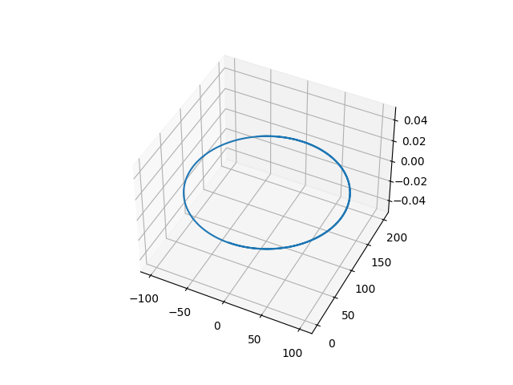
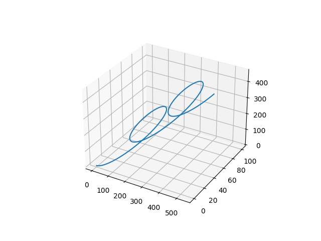
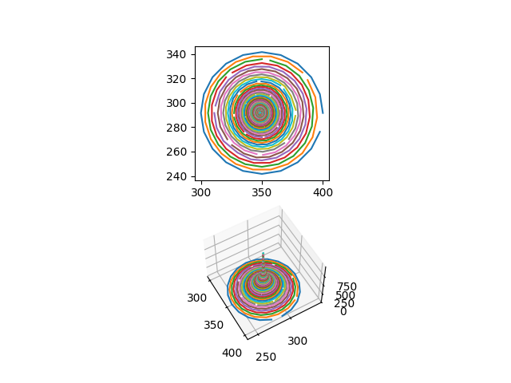
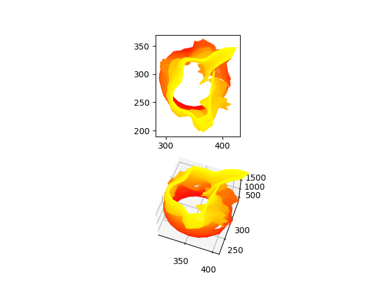
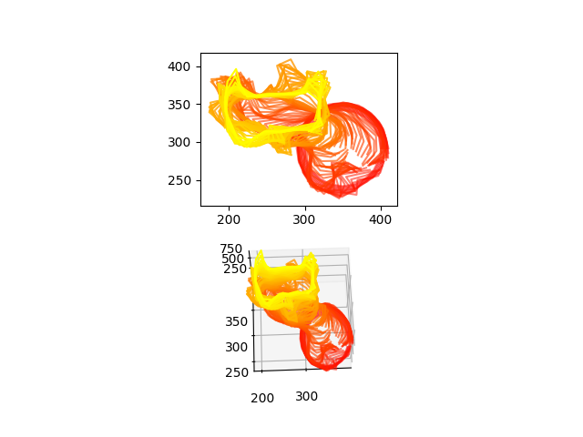

# Super Seashells

## 2019 - Initial Work

This repo is an implementation of the [Super Seashells](https://github.com/ptrgags/virtual-museum/blob/master/super_seashells.md)
family of parametric surface I made as part of a project in senior year of college.
This produces seashell surfaces with super-elliptical cross-sections.

The initial code produces a mesh in OBJ format since that is easy to generate.

## 2021-07-15 - GLB Output and Future Directions

Now that I work at Cesium and am a lot more familiar with glTF and GLB formats,
I decided to try generating shells in GLB format. This proved to be simple to
do in Python, as byte strings are easier to operate than JavaScript typed
arrays.

However, I noticed a couple things I should address in the future:

* I'm not following the glTF convention where y is up and z is forward.
* There are no materials or texture coordinates. I have plans for texturing,
    so I hope to do this soon.

### Paper Discovery

I also came across a 1992 paper ["Modeling seashells"](http://algorithmicbotany.org/papers/shells.sig92.pdf)
which did a few things different:

* The generating curve was made from Bezier curves, and not necessarily a
    closed curve.
* The paper uses the [Frenet-Serret formulas](https://en.wikipedia.org/wiki/Frenet%E2%80%93Serret_formulas)
    to compute the curve in steps of constant arc length instead of time. This
    is to give more even spacing between points
* The paper modifies the shell form with sine waves to produce ridges
* The paper uses a specialized reaction-diffusion simulation to model
    the pigmentation patterns of the shells. Recently, [I tried this out](https://github.com/ptrgags/processing-sketchbook/tree/master/SeashellTexture) in
    p5.js, eventually I want to apply that here.

I'm not sure how much of the paper I plan to implement, but I certainly want
to revisit some details here. If so, this will be done separately from the
superseashells formula.

### New Direction

Given the paper mentioned above and other things I've learned about generative
art and differential equations, I want to design a new model of abstract-looking
seashells combining these ideas:

1. A seashell shape is a cross section extruded along a curved path. Parametric
    curves like a helical spiral can be derived directly, but you could also
    define them in terms of curvature. By integrating the [Frenet-Serret formulas](https://en.wikipedia.org/wiki/Frenet%E2%80%93Serret_formulas)
    this can be generalized to _any_ 3D curve. See 
    _Differential Geometry of Curves and Surfaces_ by do Carmo. Also, a 2014
    Bridges paper["Taking a Point for a Walk"](https://archive.bridgesmathart.org/2014/bridges2014-337.pdf)
    about self-avoiding random walks seems relevant.
2. I recently learned about differential growth from a few articles: [Floraform](https://n-e-r-v-o-u-s.com/blog/?p=6721), 
    [this Medium article by Jason Webb](https://medium.com/@jason.webb/2d-differential-growth-in-js-1843fd51b0ce)
    and [this article series from Inconvergent](https://inconvergent.net/generative/differential-line/)
    It would be cool if the cross-section involved some form of differential growth
3. The Seashell ["Modeling seashells"](http://algorithmicbotany.org/papers/shells.sig92.pdf)
    describes 2 systems of differential equations for modeling the pigmentation
    patterns as a reaction-diffusion system. I want to try generalizing these
    equations in some or all of the following ways:
    * Use a variable number of chemicals, though in practice I'll probably use
        2-4 given that most image formats are limited to 4 channels
    * Create more symmetry in the equations, with plenty of parameters to
        control the amounts of each term. For example, every equation would
        get a fill rate and a kill rate, even if they're 0
    * Allow experimenting with different chemical reactions. Typical reaction
        diffusion amounts to a reaction like `A + 2B -> 3B` (see the
        [Reaction-Diffusion Tutorial](https://www.karlsims.com/rd.html) by
        Karl Sims for example). But there's so many more possibilities here,
        perhaps different ratios like `2A + 3B -> 5A` or include some sort of
        oscillatory behavior between multiple chemicals:  `A + B -> C`, 
        `B + C -> A`, `C + A -> B`. There's plenty to try here.
    * Experiment with other differential equation terms. For example, maybe try
        [advection](https://en.wikipedia.org/wiki/Advection) according to a
        velocity field? Or just put various functions (trig functions,
        polynomials, etc) in the equation until I
        find something interesting. Since I'm just simulating the differential
        equations, not solving them analytically, the sky's the limit
    * Experiment with various initial conditions
    * Experiment with different rules for controlling pigmentation
4. At least for GLB output, experiment with PBR materials. [glTF supports
    metallic-roughness](https://github.com/KhronosGroup/glTF/tree/master/specification/2.0#materials) and there are several [extensions](https://github.com/KhronosGroup/glTF/tree/master/extensions/2.0/Khronos) for other
    types of materials (transparent, sheen, transmission, etc).

This is a lot of details, and plenty I need to learn to do this effectively. I
plan to start by making p5.js sketches to experiment with some of the above.
Those will appear in my other repo, [`processing-sketchbook`](https://github.com/ptrgags/processing-sketchbook)

### Next Steps

1. Add a README for this repo. Include screenshots!
2. Add a revised version of the [Super Seashells](https://github.com/ptrgags/virtual-museum/blob/master/super_seashells.md) description. Include diagrms this time!
3. Fix the y-up issue.
4. Prototype the various parts before combining them in this repo. This could
    take a while.

### 2021-08-17 Putting The Pieces Together

In the past few weeks I've been working in my `processing-sketchbook` repo on
the three individual pieces. I'm not quite done there, but I'm far enough 
along that I can start thinking about how to combine the three simulations into
one.

I'm going to call this new seashell a "diffyshell". The "diffy" part is because
all three parts refer to differential equations, sometimes shortened to "diff EQ" or "diffy Q" when in school.

So far I've implemented `diffyshell.DifferentialPath` though it's not quite right. I can get a circular path (constant curvature, 0 torsion), but when
I add in constant torsion, I get a diagaonal path, not a helical one:

| circle - looks correct | helix - not quite there yet... |
|------------------------|--------------------------------|
|  | |

Next Steps:

* Clean up the `processing-sketchbook` projects and merge them so I don't have
    loose ends I never clean up
* Debug why the differential path doesn't give the expected path.
* port the other simulations, `DifferentialGrowth` and `DifferentialTexture`

### 2021-08-25 WIP: Differential Growth

The past couple days, I've been porting the code from the differential growth
simulation (in the `processing-sketchbook` repo on a branch) to Python for use
in making diffyshells. Most of the way done, though still have several parts of
the code to check.

Next Steps:

* Finish porting differential growth code
* Determine how to generate a triangle mesh from the growth simulation
* Change the mesh generation code to use NumPy
* Make it possible to gather the angle at each vertex, this could be
    interesting metadata

### 2021-08-26 Well it's doing something

Today I started debugging the differential growth code. Output isn't
the expected shape, but at least it's outputting something. It actually
looks pretty neat:

The top diagram is a superposition of all the cross sections. The
bottom diagram plots the slices against time (time going from bottom to top)

So it looks like it's just shrinking. I'm guessing one of the following
problems is happening:

* The simulation is running far too slowly. It does take a while for the
    growth patterns to manifest. I need to try tweaking the parameters to
    increase the itereations per row
* I also need to check that the code for repulsion forces is working correctly.

I guess we'll see.

## 2021-08-27 Unit Testing to Build Confidence

I started debugging my differential growth simulation. Though it's more
difficult here in Python as I don't have visual feedback like I do in p5.js.
In particular, the `Quadtree` class is going to be difficult to check by hand.

This is a case where I find unit testing helpful -- for the mathematical parts
of the code, being able to test assertions about the code helps me feel more
confident about the implementation. So far today I started by unit testing the
rectangle and circle classes since those are used for the quadtree circle
query. I'll do the `Quadtree` next

Next Steps:

* Continue debugging `Quadtree`

## 2021-09-07 Cross Sections

I debugged things a little more. It seems the problem had to do with pruning
nodes. I removed that code. If I need to prune empty cells, I can do that as
a separate recursive function so the `redistribute_points()` function doesn't
get messed up.

The resulting stack of cross-sections look really interesting:

| 200 rows @ 10 iters/row | 100 rows @ 50 iters/row |
|---|---|
|  |  |

Notice in the second one that the cross-sections aren't stacked but are skewed
to the side. This is because there's nothing to prevent the cross-section from
moving. 

I think that soft boundary constraints (stay within a circle) will be helpful
here, not only will it help prevent uncontrollable growth, it should keep the
overall shape roughly centered.

There's plenty that can be done still in terms of tuning the simulation. Though
another thing to think through is how to turn these cross-sections into a mesh.
I need to think about how I want to handle indexing and normals. Also, I might
want to redo the old `Mesh` class to use NumPy if I run into performance
issues.

Next Steps:

* Add circular boundary constraints
* Tweak size of simulation
* Generate mesh from the results
* Rewrite `Mesh` to use NumPy if needed